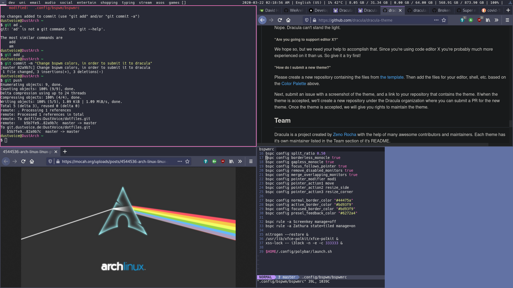
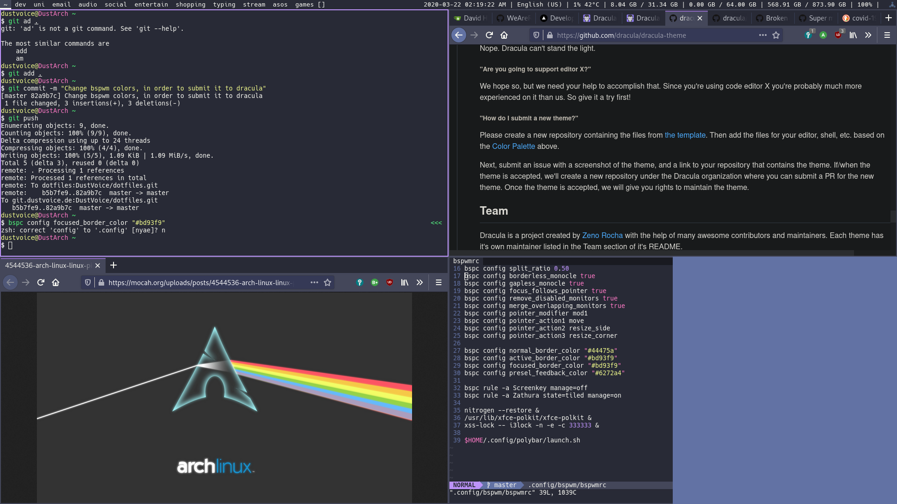
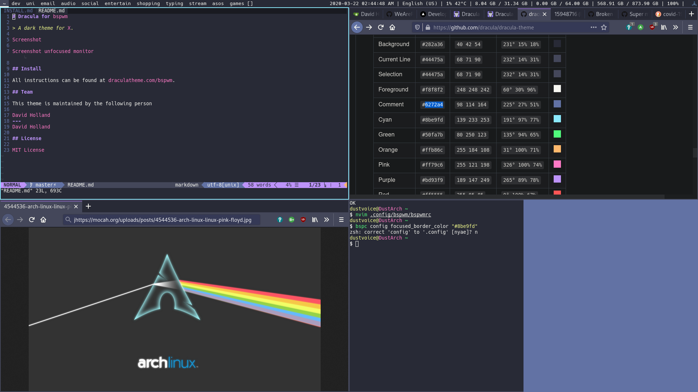

# Dracula for [bspwm](https://github.com/baskerville/bspwm)

> A dark theme for [bspwm](https://github.com/baskerville/bspwm).

**Pink accent color:**

|            |  |
| ------------------------------------------------------------------------ | ---------------------------------------------------------------------------------------------------- |
| Monitor focused (_focused node = top-left; preselection = bottom-right_) | Monitor unfocused (_focused node = top-left; preselection = bottom-right_)                           |

**Cyan accent color:**

|  |  |
| ------------------------------------------------------------------------ | -------------------------------------------------------------------------------------------------------------- |
| Monitor focused (_focused node = top-left; preselection = bottom-right_) | Monitor unfocused (_focused node = top-left; preselection = bottom-right_)                                     |

## Install

All instructions can be found at [draculatheme.com/bspwm](https://draculatheme.com/bspwm).

## Team

This theme is maintained by the following person

|  |
| ------------------------------------------------------------------------------------------------------------ |
| [David Holland](https://github.com/nesl247)                                                                  |

## Community

- [Twitter](https://twitter.com/draculatheme) - Best for getting updates about themes and new stuff.
- [GitHub](https://github.com/dracula/dracula-theme/discussions) - Best for asking questions and discussing issues.
- [Discord](https://draculatheme.com/discord-invite) - Best for hanging out with the community.

## License

[MIT License](./LICENSE)
